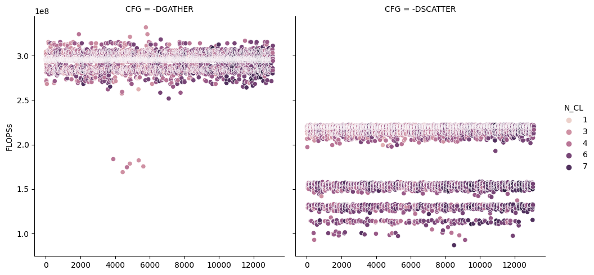

# Micro-benchmarking gather and scatter instructions

**RQ.- Can we build an analytical model of the performance of `gather` and
`scatter` instructions based on number (and set it maps to?) of cache lines
touched under _hot_ cache?**

## Results: conclusions

All raw data is under [data](data/) directory.

### Profiler

The profiler has been able to compile properly the code and generate a loop
including only the instructions we want to measure, e.g.:

```asm
	call	polybench_papi_start_counter@PLT
	test	eax, eax
	jne	.
	mov $10000, %ecx
begin_loop:
	vmovdqa	ymm2, YMMWORD PTR .LC1[rip]
	vmovaps	ymm1, YMMWORD PTR [rsp]
	vgatherdps	ymm0, DWORD PTR [r14+ymm2*4], ymm1
	sub $1, %ecx
	jne begin_loop
    mov	edi, ebx
	vzeroupper
	inc	rbx
	call	polybench_papi_stop_counter@PLT
```

This way, the profiler is only including within the loop (`begin_loop`) those
instructions we want to measure in the micro-kernel. The same example applies
for `vscatterdps`. With [this configuration](config_profiler.yml), we generate
**13122 variants or versions** of the [source code](src/main.c).

### Analyzer

Our analyzer enables the exploration of the most promising features in the
performance. The processing of data is, normally, an iterative process, where
on each step we learn more about the system to characterize or model. Thus, in
a first step, we explore data using a relational plot (see [configuration file](config_analyzer.yml)):



Gather performance seems pretty steady, regardless some outliers, but scatter
performance seems to be more volatile. 

## Experimental configuration:

* Intel(R) Xeon(R) Silver 4216 CPU @ 2.10GHz
* Compiler: GCC 11.2.0
* [MARTA Profiler Full Configuration file](config_profiler.yml)

## How to reproduce:

**NOTE: in this example we already provide the profiling data, under
[data](data/) directory, so the `profiler` step can be skipped. In case you
want to run the profiling step, please be careful with paths and input files in
the analyzer configuration file.**

1. Profiling
    ```
    # place at the root of the project
    marta_profiler examples/gather_scatter/config_profiler.yml
    # or
    python -m marta.profiler examples/gather_scatter/config_profiler.yml
    ```

    This step should take around 2 hours (Intel Xeon Silver 4216). This will
    generate a CSV file with all measurements and dimensions of interest in
    `examples/gather_scatter/src/marta_profiler_data`. This will be the data
    used by the analyzer.

2. Analysis
    ```
    # place at the root of the project
    marta_analyzer examples/gather_scatter/config_analyzer.yml
    # or
    python -m marta.analyzer examples/gather_scatter/config_analyzer.yml
    ```

    This step is almost immediate (around 10 seconds), and will generate a
    series of plots and files with the result of the classification algorithms
    (decision tree) and the feature importance analyzer (random forest classifier).